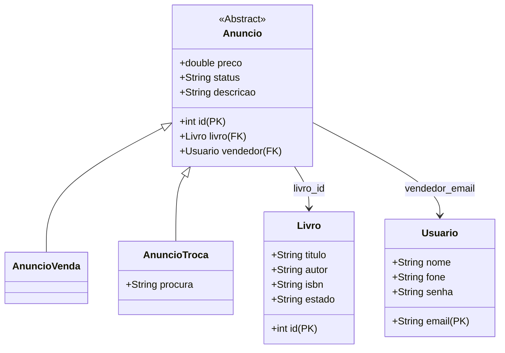

# Relatório de Arquitetura do Backend - TradeLibrary

Este relatório detalha a arquitetura de backend do projeto **TradeLibrary**, descrevendo a estratégia de persistência de dados utilizando SQLite/ORMLite e como o fluxo de dados foi integrado aos controladores da interface gráfica JavaFX.

---

## 1. Visão Geral da Tecnologia
O projeto foi construído seguindo a arquitetura **MVC (Model-View-Controller)** com as seguintes tecnologias de backend:
*   **Linguagem de Programação**: Java 25 (padrão orientado a objetos).
*   **Banco de Dados**: SQLite (embarcado, persistido localmente no arquivo `tradelibrary.db`).
*   **Mapeamento Objeto-Relacional (ORM)**: ORMLite 6.1 (biblioteca leve para persistência Java).
*   **Framework UI**: JavaFX 26 (frontend modular e reativo).

---

## 2. Modelagem do Banco de Dados e Mapeamento ORM

As tabelas do banco de dados foram mapeadas a partir das classes de domínio (Model) usando anotações do ORMLite (`@DatabaseTable` e `@DatabaseField`).

### Detalhes das Entidades Persistidas

1.  **[Usuario](file:///home/brunba/Documents/Shit/Escuela/POO/g5/model/Usuario.java)**:
    *   Tabela no BD: `usuarios`.
    *   Chave Primária: `email` (String).
2.  **[Livro](file:///home/brunba/Documents/Shit/Escuela/POO/g5/model/Livro.java)**:
    *   Tabela no BD: `livros`.
    *   Chave Primária: `id` (gerada automaticamente pelo banco).
3.  **[Anuncio](file:///home/brunba/Documents/Shit/Escuela/POO/g5/model/Anuncio.java) (Classe Abstrata)**:
    *   Não cria uma tabela própria, mas define as colunas estruturais que são herdadas pelas subclasses persistidas.
    *   Relacionamentos configurados:
        *   `livro`: Chave estrangeira ligada à tabela `livros` com carregamento automático (`foreignAutoRefresh = true`).
        *   `vendedor`: Chave estrangeira ligada à tabela `usuarios` (`foreignAutoRefresh = true`).
4.  **[AnuncioVenda](file:///home/brunba/Documents/Shit/Escuela/POO/g5/model/AnuncioVenda.java)**:
    *   Tabela no BD: `anuncios_venda`.
    *   Harda as características básicas de `Anuncio`.
5.  **[AnuncioTroca](file:///home/brunba/Documents/Shit/Escuela/POO/g5/model/AnuncioTroca.java)**:
    *   Tabela no BD: `anuncios_troca`.
    *   Herda chaves e dados comuns e adiciona a coluna específica `procura` (texto contendo o livro desejado pelo anunciante).

---

## 3. Gerenciamento de Conexão ([Database.java](file:///home/brunba/Documents/Shit/Escuela/POO/g5/model/Database.java))

A classe `Database` gerencia a conexão com o SQLite via singleton thread-safe (`getConnectionSource()` sincronizado). Ela é responsável por:
1.  Abrir e manter a fonte de conexão JDBC (`jdbc:sqlite:tradelibrary.db`).
2.  **Inicialização das Tabelas**: Executar `TableUtils.createTableIfNotExists` para cada uma das classes de domínio na primeira execução:
    *   `Usuario`
    *   `Livro`
    *   `AnuncioVenda`
    *   `AnuncioTroca`
3.  Garantir o encerramento correto da conexão no fechamento da aplicação JavaFX através do método `stop()` em [Main.java](file:///home/brunba/Documents/Shit/Escuela/POO/g5/Main.java).

---

## 4. Camada de Acesso a Dados (Padrão Repository)

Para isolar o banco de dados da interface gráfica, implementamos a persistência utilizando o padrão de projeto *Repository*.

*   **[UsuarioRepository](file:///home/brunba/Documents/Shit/Escuela/POO/g5/model/UsuarioRepository.java)**:
    *   Encapsula operações da tabela `usuarios`.
    *   Métodos implementados: `cadastrar()`, `buscarPorEmail()`, `emailExiste()`, `validarLogin()`, `atualizar()` e `remover()`.
    *   Se a tabela estiver vazia, cria automaticamente um usuário administrador/demo (`guilhermew@email.com`).
*   **[AnuncioRepository](file:///home/brunba/Documents/Shit/Escuela/POO/g5/model/AnuncioRepository.java)**:
    *   Gerencia transações de anúncios de venda e troca de forma unificada.
    *   Métodos implementados:
        *   `cadastrarAnuncioVenda()` / `cadastrarAnuncioTroca()`: Garante a consistência do banco gravando primeiro a entidade `Livro` e em seguida a correspondente do anúncio.
        *   `listarTodos()`: Consulta ambas as tabelas (`anuncios_venda` e `anuncios_troca`), unifica-as em uma coleção genérica `List<Anuncio>` e retorna para a UI.
        *   `atualizarAnuncio()` e `removerAnuncio()`: Identifica dinamicamente a subclasse através de polimorfismo (`instanceof`) para executar a respectiva query.
    *   **Seed de Testes**: Inicializa anúncios fictícios de exemplo caso nenhuma oferta esteja listada no banco.

---

## 5. Integração com a UI (Controllers e Fluxos de Navegação)

A sincronização de telas e os eventos da aplicação foram adaptados para consumir as classes persistentes de backend.

### Cadastro de Novos Anúncios
1.  O [AddBookController](file:///home/brunba/Documents/Shit/Escuela/POO/g5/controller/AddBookController.java) valida as entradas da tela.
2.  Obtém o anunciante logado através da sessão unificada ([SessionManager](file:///home/brunba/Documents/Shit/Escuela/POO/g5/controller/SessionManager.java)).
3.  Cria os objetos `Livro` e `Anuncio` e delega a gravação ao `AnuncioRepository`.
4.  Reseta os inputs caso a gravação no banco termine com sucesso.

### Exibição do Catálogo Dinâmico
1.  O [CatalogController](file:///home/brunba/Documents/Shit/Escuela/POO/g5/controller/CatalogController.java) busca a lista de anúncios usando `AnuncioRepository.listarTodos()`.
2.  Itera a lista carregando de forma assíncrona/programática o FXML de cards individuais (`BookCard.fxml`).
3.  Para cada card, instancia um [BookCardController](file:///home/brunba/Documents/Shit/Escuela/POO/g5/controller/BookCardController.java) passando o anúncio correspondente via construtor, exibindo dinamicamente as informações do livro, preço/troca e vendedor.

### Fluxo de Navegação e Detalhes
1.  **Singleton de Navegação**: O [ViewController](file:///home/brunba/Documents/Shit/Escuela/POO/g5/controller/ViewController.java) (controlador principal da aplicação) expõe sua própria instância ativa (`ViewController.getInstance()`).
2.  Ao clicar no botão "Ver Mais" em um card:
    *   O evento dispara a navegação chamando `ViewController.getInstance().mostrarDetalhesLivro(anuncio)`.
    *   O painel principal carrega `BookDetailsView.fxml` no container central (`contentArea`).
3.  O [BookDetailsController](file:///home/brunba/Documents/Shit/Escuela/POO/g5/controller/BookDetailsController.java) recebe o anúncio e exibe as descrições, dados do livro e as informações de contato do vendedor para viabilizar a transação. O botão de retorno chama `ViewController.getInstance().navToCatalog()`.
