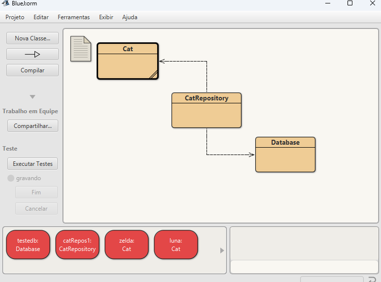
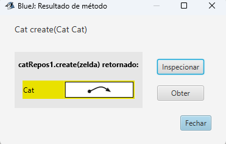
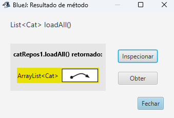
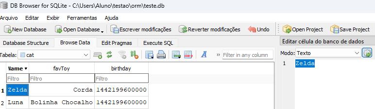

Após criados um objeto de banco de dados, assim como o repositório, os objetos Cat podem ser criados.

Depois de usar os setters para definir os atributos dos objetos, o método Create do repositório traz os objetos para o repositório.

Deve-se então usar o método loadAll para carregar todos os objetos no repositório para o banco de dados.

O banco de dados agora pode ser analisado, filtrado e verificado por outro aplicativo de banco de dados. 

